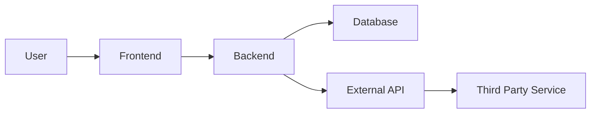
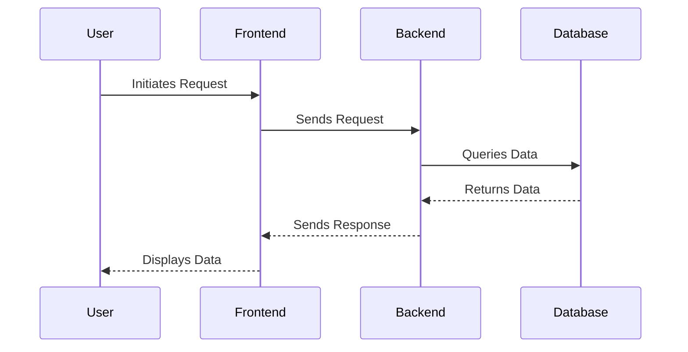

# Milestone Solutions Document

## 1. Overview
<!-- Provide a high-level overview of the system or feature being described. -->

## 2. Data Flow
<!-- Describe the data flow within the system. Use diagrams where necessary. -->

### 2.1 Data Flow Diagram

## 3. Sequence Diagram
<!-- Provide a sequence diagram to describe the interaction between different components of the system. -->

## 4. Security Concerns
<!-- Describe any security concerns and how they are addressed. -->

## 5. Privacy Concerns
<!-- Describe any privacy concerns and how they are addressed. -->

## 6. Other Considerations
<!-- Describe any other architectural considerations, such as scalability, performance, etc. -->
