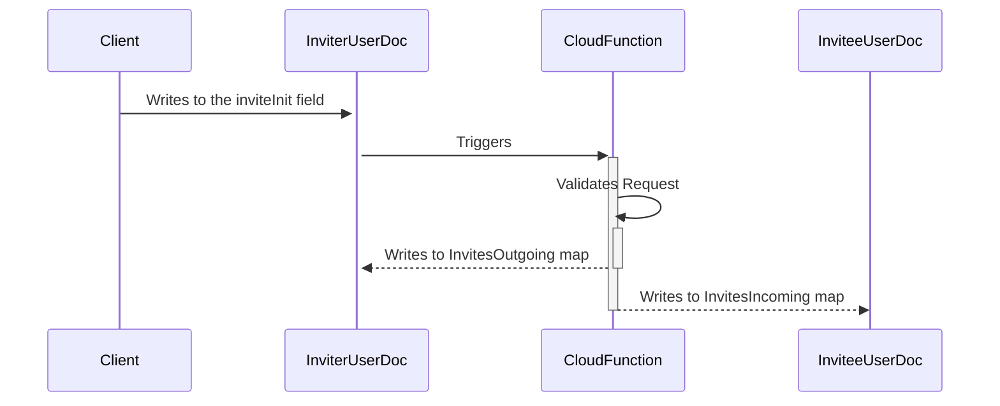

---
story:
name: Feature Request
about: Suggest an idea for improving the platform.
labels: enhancement
---

# Feature/User Story Description

## User Story**: As a [type of user], I want to [perform some task] so that [achieve some goal]

## Description

[Provide a detailed description of the feature or user story, including any relevant context, background information, and acceptance criteria.]

## Acceptance Criteria

1. [Criterion 1]
2. [Criterion 2]
3. [Criterion 3]
   - [Sub-criterion, if applicable]

## Data Flow
<!-- Describe Data flow here. -->

###  Sequence Diagram (optional)
<!--

-->
## Security Concerns
<!-- Add security concerns here. e.g.:
We have to ensure that:
* The user is writing to their own user doc
* The invitee exists
* Their isn't an existing friend relationship
* The Gardens are owned by requestor -->

## Privacy Concerns
<!-- Add privacy concerns here. e.g.:
Only the username and profilePic can be shared prior to friend acceptance
-->
## Coding Plan
<!--
- [ ] Write tests for firestore.rules
- [ ] Update firestore rules
- [ ] write tests for cloud function that handles business logic
- [ ] Write cloudfunction that is triggered by user doc change to handle business logic
-->
## Additional Information**

[Add any additional information that might be helpful, such as related links, documents, or discussions.]

## Coding Plan

- [ ] Task list one
- [ ] Task List two
